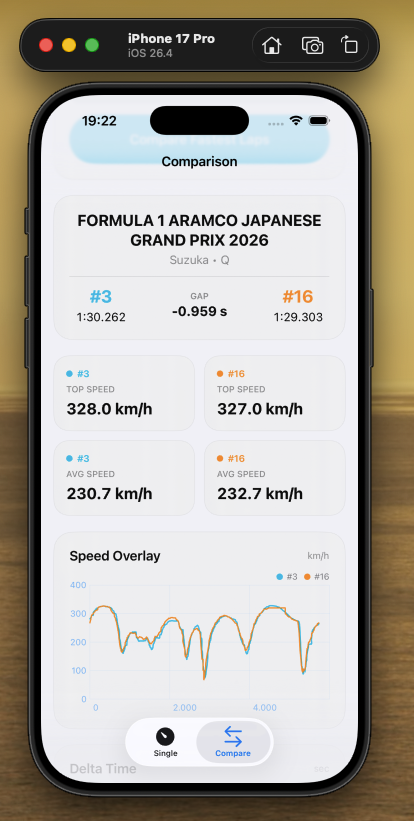
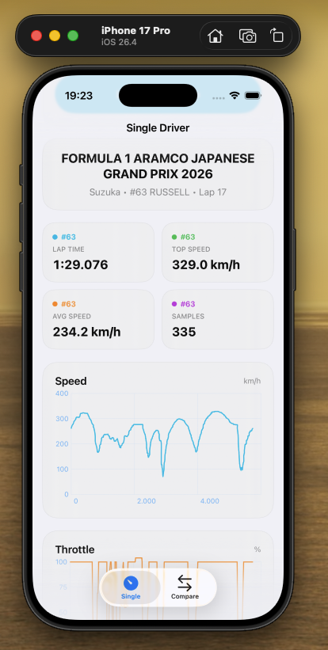
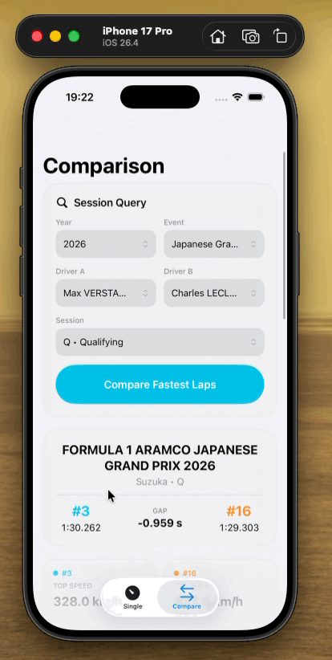
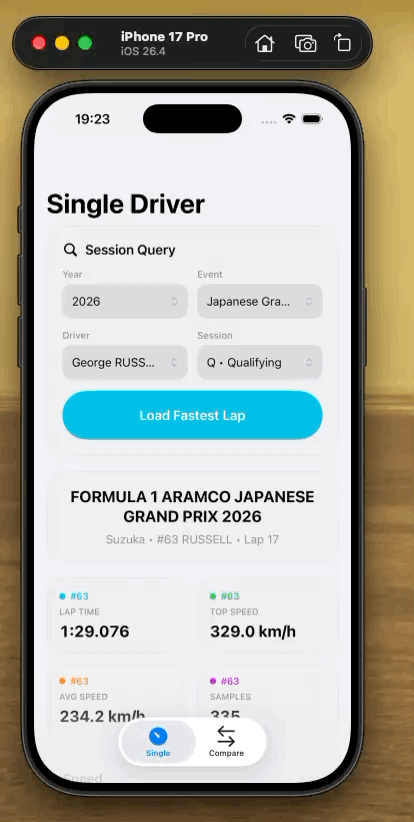

<p align="center">
  <br>
  <b style="font-size:2.6em;"><u>SwiftF1Telemetry</u></b><br><br>
  <a href="https://swiftpackageindex.com/Al3x18/SwiftF1Telemetry">
    
  </a><br>
  <a href="https://swiftpackageindex.com/Al3x18/SwiftF1Telemetry">
    
  </a>
</p>

`SwiftF1Telemetry` is a pure Swift package for loading, parsing, caching, and processing Formula 1 telemetry data directly on device.

The project is inspired by the behavior of [FastF1](https://github.com/theOehrly/Fast-F1), but it is not a pandas-style port. Instead, it provides a Swift-native API built around typed models, async/await, disk caching, telemetry processing, and chart-ready outputs.

Current documented release: `0.4.3`

## Documentation

- The official package documentation lives in the repository `docs/` folder and is intended to be the single source of truth for package usage and API guidance.
- Start from [docs/overview.md](docs/overview.md) for the documentation hub.
- Swift Package Index is configured to link to that external documentation.

Repository guides:

- [Platform Support](docs/platform-support.md)
- [SwiftUI Integration](docs/swiftui-integration.md)
- [Contributing Guide](CONTRIBUTING.md)
- [License](LICENSE)
- [Changelog](CHANGELOG.md)

## Status

`SwiftF1Telemetry` is currently in early development.

Implemented:

- Real session resolution from archive data
- Discovery APIs for available years, events, sessions, and drivers
- Enriched driver discovery (number, name, surname, abbreviation, team)
- Fastest-lap lookup and telemetry extraction (by driver number or name-based identifier)
- Two-lap / two-driver fastest-lap telemetry comparison
- Chart-ready telemetry and comparison series
- Disk caching with configurable storage profiles
- Public Codable models and CLI smoke usage (`f1-cli`)

In progress:

- Additional FastF1 parity for edge-case lap reconstruction
- Broader cross-season and cross-session validation
- Linux validation and test coverage (Linux support is expected to work but is not fully tested yet)
- Android/Flutter integration assessment: currently complex and time-consuming, deferred to a future dedicated phase

## Installation

Add the package to your `Package.swift`:

```swift
dependencies: [
    .package(url: "https://github.com/Al3x18/SwiftF1Telemetry.git", from: "0.4.3")
]
```

Then add the product to your target:

```swift
dependencies: [
    .product(name: "SwiftF1Telemetry", package: "SwiftF1Telemetry")
]
```

## Quick Start

```swift
import SwiftF1Telemetry

let client = F1Client()

let session = try await client.session(
    year: 2024,
    meeting: "Monza",
    session: .qualifying
)

guard let lap = try await session.fastestLap(driver: "16") else {
    return
}

let telemetry = try await session.telemetry(for: lap)

print("Lap:", lap.lapNumber)
print("Lap time:", lap.lapTime ?? 0)
print("Samples:", telemetry.samples.count)
print("Speed series points:", telemetry.speedSeriesByDistance().count)
```

SwiftUI short example:

```swift
import SwiftUI
import SwiftF1Telemetry

struct QuickTelemetryView: View {
    @State private var text = "Tap to load"
    let client = F1Client()

    var body: some View {
        Button(text) {
            Task {
                do {
                    let s = try await client.session(year: 2024, meeting: "Monza", session: .qualifying)
                    guard let lap = try await s.fastestLap(driver: "16") else { text = "No lap"; return }
                    let t = try await s.telemetry(for: lap)
                    text = "Samples: \(t.samples.count)"
                } catch { text = "Error: \(error)" }
            }
        }
    }
}
```

You can also customize cache behavior:

```swift
var configuration = F1Client.Configuration.default
configuration.cacheMode = .medium

let client = F1Client(configuration: configuration)
```

You can also compare two drivers directly:

```swift
let comparison = try await session.compareFastestLaps(
    referenceDriver: "16",
    comparedDriver: "55"
)

print("Final delta:", comparison.finalDelta ?? 0)
print("Delta points:", comparison.deltaSeriesByDistance().count)
print("Reference speed points:", comparison.referenceSpeedSeriesByDistance().count)
print("Compared speed points:", comparison.comparedSpeedSeriesByDistance().count)
```

Driver lookup supports number, surname, and abbreviation:

```swift
let byNumber = try await session.fastestLap(driver: "16")
let bySurname = try await session.fastestLap(driver: "Leclerc")
let byAbbreviation = try await session.fastestLap(driver: "LEC")
```

And you can guide users through discovery instead of asking them to guess input values:

```swift
let years = try await client.availableYears()
let events = try await client.availableEvents(in: 2024)
let sessions = try await client.availableSessions(in: 2024, event: "Monza")
let drivers = try await client.availableDrivers(in: 2024, event: "Monza", session: .qualifying)
```

Discovery APIs throw typed `F1TelemetryError` values when the requested year, event, session, or driver list is not available, so callers can guide users without falling back to generic network error handling.

## Testing

Run the test suite with:

```bash
swift test
```

Run the CLI smoke test with:

```bash
swift run f1-cli 2024 Monza Q 16
```

Try the discovery flow with:

```bash
swift run f1-cli discover
swift run f1-cli discover 2024
swift run f1-cli discover 2024 Monza
swift run f1-cli discover 2024 Monza Q
```

Telemetry lookup also accepts names:

```bash
swift run f1-cli 2024 Monza Q 16
swift run f1-cli 2024 Monza Q Leclerc
swift run f1-cli 2024 Monza Q LEC
swift run f1-cli 2024 Monza Q Leclerc Sainz
```

The discovery command uses the archive-backed years and sessions that are actually available to the library. If a year or session is not exposed by the official archive, the CLI now reports that clearly instead of surfacing a raw HTTP error.

## Versioning

This package follows the standard Swift Package Manager versioning model:

- use Semantic Versioning
- create Git tags such as `1.0.0`, `1.0.1`
- publish GitHub Releases from those tags
- treat the Git tag as the authoritative package version

The repository includes:

- `CHANGELOG.md` for release notes
- `CONTRIBUTING.md` for contribution guidelines
- `LICENSE` with the MIT license text
- `SwiftF1TelemetryVersion.current` as a convenience runtime string

## Project Scope And Roadmap

Detailed package usage and API guidance live in [docs/overview.md](docs/overview.md).

## iOS Example App

> Looking for a complete iOS integration example?
> Repository: [AppSwiftF1Example](https://github.com/Al3x18/AppSwiftF1Example)

<div align="center">
  <a href="https://github.com/Al3x18/AppSwiftF1Example">
    
  </a>
  <a href="https://github.com/Al3x18/AppSwiftF1Example">
    
  </a>
</div>

<div align="center">
  <a href="https://github.com/Al3x18/AppSwiftF1Example">
    
  </a>
  <a href="https://github.com/Al3x18/AppSwiftF1Example">
    
  </a>
</div>
